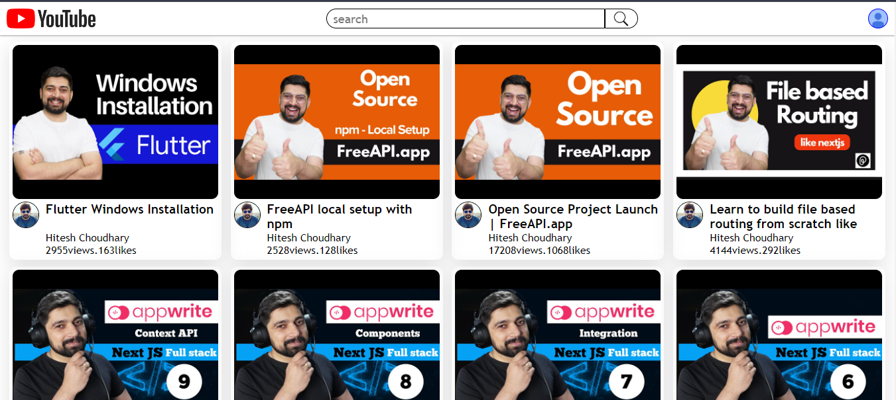
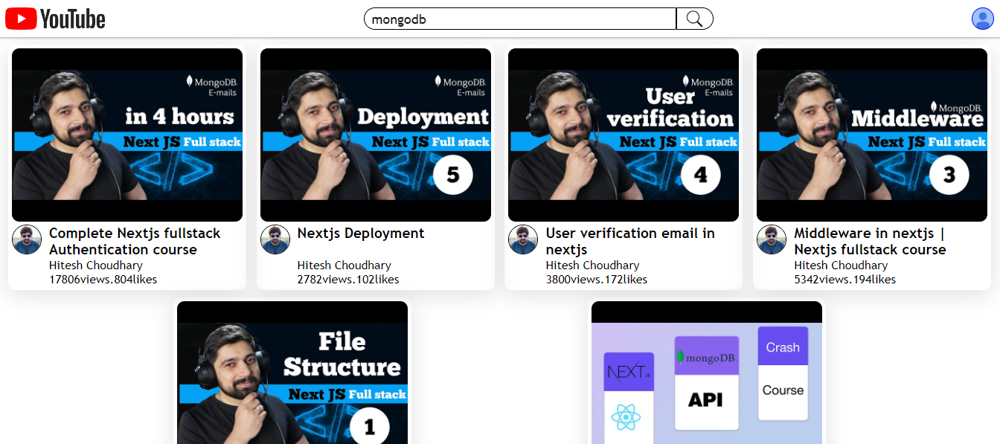
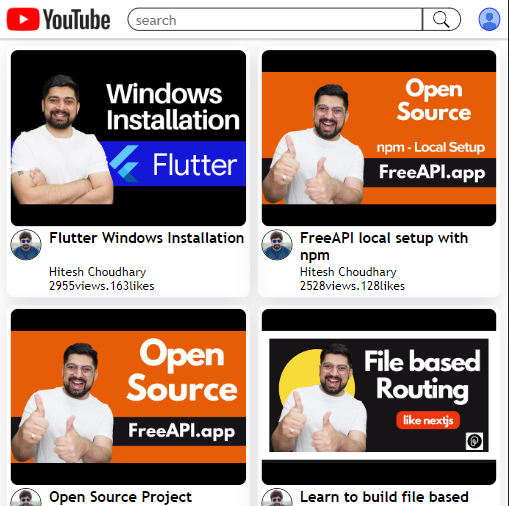

# Youtube Style Listing Web App

This web application provides a seamless experience for browsing and discovering videos using the [FreeAPI YouTube Videos API](https://api.freeapi.app/api/v1/public/youtube/videos).

## Features
- **Video Display:**
  - Displays each video with its thumbnail, title, channel name, channel profile image, views, and likes.
  
  

- **Video Interaction:**
  - Clicking on a video will open it directly on YouTube.

- **Channel Interaction:**
  - Clicking on the channel name or profile image will open the respective channel page on YouTube.

- **Search Functionality:**
  - Users can search for videos based on provided tags to explore relevant content efficiently.

  

- **Responsive Design:**
  - The site is fully responsive and adapts seamlessly across devices for a consistent user experience.

  

## Live Demo
[Visit the Web App](https://youtube-video-listing-gold.vercel.app/)

